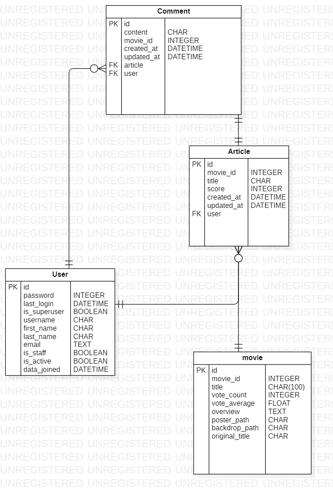

# Moving _ 영화 관련 웹사이트

## 1. 팀원 정보 및 업무 분담 내역

#### 김재유

* Front end (client)
* CSS 구성
* 영화 오픈 API 호출 및 영화 관련 페이지 구현 (Vue + django)
* 영화 추천 알고리즘 구현 (Vue + django)

#### 백민주

* Back end (server)
* 데이터 관련 정보 수집 및 관리(ERD)
* 게시판 및 댓글 서비스 구성(Vue + django)
* User 관련 정보 처리 구현 (Vue + Django)

## 2. 목표 서비스 구현 및 실제 구현 정도

- 목표 서비스

  - 직관성
  - 단순성
  - 효율성

  

- 실제 구현 사이트

  - 메인페이지에서 한눈에 시각적으로 영화의 평점을 확인하고, 추천 받을 수 있는 서비스를 목표로 하였습니다.

    - 평점에 따라 `포스터의 크기`를 다르게 출력하여 직관적으로 알 수 있도록 했습니다.

    - 사용자의 평가를 기반으로 한 추천 영화들은 `흔들림 효과`를 넣어서 자연스러운 접근을 유도했습니다. 

      

  - 구성을 간소화 해 불필요한 사용자의 이동을 줄였습니다.

    - `Mainpage` 와 `Detailpage`로만 구성해 단순화하였습니다.

    - 게시판을 영화 상세페이지에 포함시켰습니다.

    - 영화에 대한 구체적인 설명보다는 `트레일러 영상`을 제공하였습니다.

    - `Pinterest 스타일`의 화면 구성을 통해, 정적이면서 동시에 동적인 디자인을 제작했습니다.

    - `SideBar`나 `Layover`, `Collapse` 등의 기능을 통해 한 페이지에 많은 정보를 담았습니다.

    - `Pagination` 대신의 `Infinity Scroll`을 통해 단순화와 데이터효율을 확보했습니다.

      

  - 불필요한 요소를 제거해 페이지에 집중력을 높였습니다.

    - `텍스트의 최소화`을 통해 시선 분산을 방지했습니다.
    - `아이콘`을 활용해 직관성을 높였습니다.
    - 어두운 색을 전체적인 분위기로 잡고, 노란 계열의 색을 `포인트 컬러`로 활용하였습니다.

    

- 구현하지 못한 서비스

  - `autocomplete`을 활용한 `searchBar`를 초기 기획했으나, 페이지의 방향성와 맞지 않아 생략하였습니다.
  - Backdrop이미지와 함께 `명대사` 을 추가해 흥미를 유발하려 했으나, 특정 영화에만 출력되는 경우가 있어 생략했습니다.

## 3. 데이터베이스 모델링(ERD)

## 4. 필수 기능에 대한 설명

#### A. 관리자 뷰

- 관리자는 장고에서 제공해주는 `admin site`를 통해 영화정보와 게시글을 모두 생성, 읽기, 수정, 삭제할 수 있도록 하였습니다.

  

#### B. 영화 정보

- 영화 데이터
  - 영화정보는 `TMDB` 을 기반으로 불러왔습니다.
  -  초기에 넣어준 400개의 영화을 통해 관련영화, 추천영화를 끊임없이 타고 들어갈 수 있습니다.
  -  관련영화, 추천영화를 API를 통해 불러올 때, DB에 담아 주는 기능을 추가할 예정입니다.

- 영화 정보 제공

  - Mainpage에서 DB에 담겨있는 영화를 무작위로 제공합니다.

  - 이때 포스터로 제공되며, 그 크기는 평점에 따라 다르게 표현됩니다.

  - 각 영화에 대한 Detail page가 있으며, 상세정보, 트레일러 영상, 관련영화 등이 제공됩니다.

    

#### C. 추천 알고리즘

* 사용자가 최근 좋게 평가한 영화(3점 이상)을 기반으로 추천 영화를 제공했습니다.

* 추천 영화는 다른영화와 함께 Mainpage에서 제공되며, `흔들림 효과`를 넣어 직관적으로 알 수 있도록 하였습니다.

  

#### D. 커뮤니티

- 게시글
  - 커뮤니티는 각 영화의 상세페이지에서 이루어집니다.
  - 영화에 대한 점수, 한줄평을 남길 수 있습니다.
  - 이때 사용자는 한 영화에 대해 한개의 평가만 남길수 있도록 하여 평점 조작을 방지하였습니다.
  - 모든 글은 작성자 본인만 수정, 삭제 가능합니다.
  - 만일 글이 수정되었다면, `수정됨`이라는 문구를 작게 나타냈습니다.
  - `아이콘`을 활용해 화면을 단순화 했습니다.

- 댓글

  - 댓글은 한줄평에 대한 대댓글 형태로 구현했습니다.
  - 영화에 대해 의견을 주고 받을 수 있도록 하였습니다.
  - 모든 댓글은 작성자 본인만 삭제 가능합니다.

  

## 5. 배포 서버 URL

https://ssafingmoving.netlify.app/

## 6. 기타(느낀점) 

### 김재유

>  실제 명세에 따른 서비스를 제공하면서 사이트 구성의 전체적인 흐름을 이해할 수 있었습니다. 
>
>  이 때 가장 중요한 것은 ERD를 잘 구성하는 것이라고 느꼈습니다. 사용자에게 가장 가깝게 다가오는 것은 UI, UX이지만 이 모든 것의 기반에는 데이터의 원활한 흐름이 뒷받침 될 때 가능한 것입니다.   저는 주로 Front 기반의 작업을 진행했지만, 제가 원하는 것을 표현하려고 할때마다 백민주 팀원의 도움이 필요했습니다. 제가 원하는 정보를 Back-end에서 구성하고 원하는 형태로 불러와 제공해줘서 가능한 작업이었습니다. 사람들은 겉모습으로 무엇갈 평가하지만, 사실 내부에 탄탄한 구성이 있을 때, 외부가 원할하게 보여진다 생각합니다.
>
>  UI는 예상한대로 안되고 UX는 예상치 못한 곳에서 문제가 발생했습니다. 둘 다 생각한대로 흘러가지 않았습니다. 
>
>  UI를 구성하기 위해서 다양한 tool들을 확인하고 우리 사이트의 방향성의 맞도록 수정했습니다. 하지만 다른 구조가 생기거나, 다른 데이터를 필요로 할때마다 계속되는 수정이 필요했습니다. 이 과정 속에서 해당 기능의 움직임과 흐름에 대해 보다 명확하게 이해할 수 있었습니다.
>
>  UX는 개발자의 아픈 손가락입니다. 
>
>  내 자식처럼 소중하게 만든 코드이지만, 사용자에겐 그저 불편요소입니다. 사용자에 맞게 수정한 부분도 있지만 그렇지 못한 부분도 당연히 있길 마련입니다. 꼭 필요로 하는 구성, 기능이지만, 그 과정속에서 사용자는 불편함을 느낄 수 있습니다. 개발자도 이를 알지만 다른 구성과의 상호관계, 혹은 능력부족으로 이를 수정하지 못하고 그대로 배포할 수 밖에 없는 상황도 있습니다. 
>
>  겨우 일주일짜리 작은 프로젝트였지만, 배우고 느낀건 이번 한학기 그 이상일 수도 있습니다. 처음해보는, 이제 막 개발자의 발담근 시기이지만 이 경험 항상 생각하며 개발자의 길을 걷도록 하겠습니다.

### 백민주

> 이번 프로젝트를 하며 실무 역량을 키울수 있었습니다. 그리고 실무 역량에 대해 생각해 보는 계기가 되었습니다.
>
> 첫 프로젝트를 진행하며 1학기 내내 배웠던 내용들을 다시 한번 더 보며 실무에서 어떻게 쓰이고 왜 필요한지 이해 할 수 있었습니다. 제가 맡았던 Back-end를 다루며 Django뿐만 아니라 Vue 또한 사용또한 원활하게 이루어져야 한다는 것을 느꼈습니다. Vue의 axios를 통해 server 단에 요청을 보내고 Django에서 데이터를 처리해주고 다시 보내주는 과정을 반복하며 vue의 편의성과 용이성을 알게 되었습니다. 그리고 프로젝트를 수행할 때 소통이 중요하다는 것을 다시 한번  깨달았습니다. 제가 Server단에서 Client 단에 어떤 정보를 주냐에 따라 기능 구현에 직결되었습니다. 그렇기에 김재유 페어와 계속해서 소통하며 웹사이트를 구성했고 만약 소통이 잘 되지 않았다면 이정도 퀄리티를 내지 못했을것입니다.
>
> 사용자는 UI를 통해 사이트의 사용 유무를 결정합니다. 그렇기에 사용자에게 제공될 UI를 뽑아내는 것이 너무 어려웠습니다. 하지만 부족했던 부분들을 김재유 페어가 초반에 계획했던 UI에 맞춰 Front-end를 다루어 주어 제가 Back-end에 집중할 수 있었습니다.
>
> Back-end를 다루며 사용자 편의에 맞게 기능을 제공하는 것이 정말 어려웠습니다. 제가 코드를 짤때는 고려하지 않았던 것들이 사용자에게 불편함을 주었습니다. 다수의 불편함을 없애기 위해 저의 부족한 코딩 실력으로 잠을 줄여가며 공부하였습니다. 
>
> 일주일이라는 짧으면 짧고 길면 긴 프로젝트 기간동안 어떻게 데이터를 다루고 사용할지와 같은 실무적 능력을 배울수 있었습니다. 그리고 한학기동안 배운 내용들을 다시 한번 리마인드할 수 있어서 좋았습니다.

